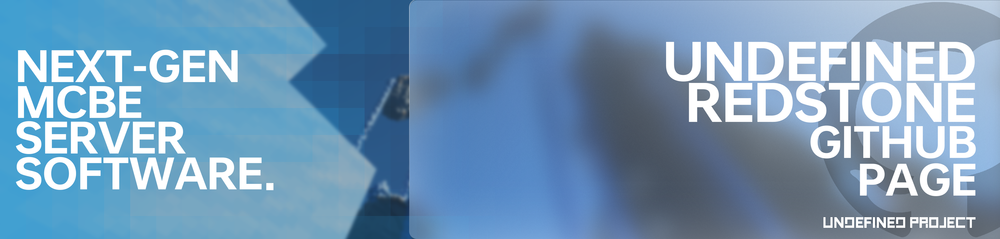

<div align="center">
  <a href="https://github.com/UndefinedProjectMC/UndefinedRedstone">
    
  </a>
  <h3 align="center">基于Rust语言编写的下一代 我的世界: 基岩版 服务端软件</h3>

  <a href="https://github.com/UndefinedProjectMC/UndefinedRedstone/actions"></a>
  <a href="https://feedback.minecraft.net/hc/en-us/articles/28105668043661-Minecraft-1-21-2-Bedrock"></a>
  <a href="https://github.com/UndefinedProjectMC/UndefinedRedstone/tree/main/crates/undefined_redstone_network/src/protocol"></a>

  ### [English](README.md) | 简体中文(中国大陆) | [正體中文(台灣地區)](README_zh_TW.md) | [Русский](README_ru.md)
</div>

## 🎉介绍🎉
### 界游服务端(Undefined Redstone) 是基于Rust编程语言编写的 我的世界: 基岩版 服务端软件
界游服务端基于 **ECS (实体-组件-系统)** 架构的同时大量使用了多线程及异步，使得服务端性能优异、代码整洁. 得益于Bevy ECS的插件系统, 界游服务端可以轻松进行模块化构建。
> [!IMPORTANT]
> 此项目仍处于非常早期的开发阶段，可能会有大量的**未知BUG、漏洞未修复**及**大量的功能未实现**。
> 
> 此外, 该项目**尚未发布官方发行版**，因此所有测试版都将通过**Github Actions**进行构建。
> 
> 我们强烈建议**不要将此项目用于生产环境**，即使某些部分可能已经完成编写，除非官方发行版已经发布。
## 🎶特性🎶
- **模块化**：界游服务端的模块化设计可以使开发者轻松地进行代码修改。

- **便捷的版本管理**：
  - 基于模块化设计理念，界游服务端没有指定任何 我的世界: 基岩版 版本。
  - 你只需要将版本包拖入version_control文件夹中即可自动加载指定版本的生物、物品、配方等。
  - 在将来，我们将进一步支持更高程度的模块化及自定义。

- **ECS架构**：我们紧随 我的世界：基岩版 的脚步，使用了ECS架构对游戏内容进行管理。这使得重复代码更少、内存管理更高效、同时拥有了高度的自定义程度及高度的模块化程度。

- **安全、高性能与低占用三者兼得**：
  - 得益于Rust编程语言，我们将内存安全与高性能带入了 我的世界: 基岩版 服务端软件中。
  - 相比于使用PHP和Java编程语言开发的服务端软件，我们拥有更高的性能、更低的占用及更好的内存管理。

- **大量异步及多线程支持**：我们使用了大量异步及多线程，最大程度利用多核CPU，减少性能浪费。

## 🎆开始使用🎆
#### 由于界游服务端使用Rust语言编写，因此你需要使用Cargo进行构建
[下载Rust编程语言](https://www.rust-lang.org/zh-CN/learn/get-started)

**直接运行**
```shell
cargo run --package undefined_redstone_startup --bin undefined_redstone_startup
```

**自行构建**
```shell
cargo build --package undefined_redstone_startup --bin undefined_redstone_startup
```

## 👉反馈👈
#### 我们需要你帮助我们反馈此项目中存在的任何Bug及漏洞。同时你如果有什么建议，也欢迎提出。

[Issues页面](https://github.com/UndefinedProjectMC/UndefinedRedstone/issues)

你也可以加入我们的Discord群组或邮箱致电dev@iruanp.com

## 📄许可证📄

**版权所有 © 2024 UndefinedProject，保留所有权利。**

若未特别指明，项目内容均采用LGPL-3.0协议开源。

以下文件夹内的内容以Apache-2.0协议开源：
- undefined_redstone_plugin
