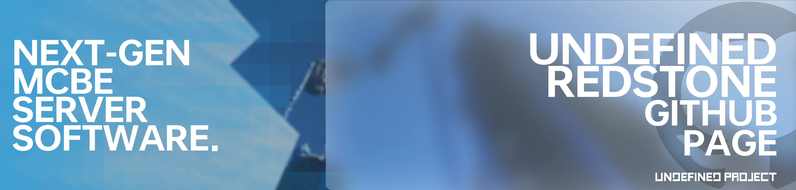

<div align="center">
  <a href="https://github.com/UndefinedProjectMC/UndefinedRedstone">
    
  </a>
  <h3 align="center">基於Rust程式語言打造的次世代 Minecraft: 基岩版 伺服器軟體</h3>

  <a href="https://github.com/UndefinedProjectMC/UndefinedRedstone/actions"></a>
  <a href="https://feedback.minecraft.net/hc/en-us/articles/28105668043661-Minecraft-1-21-2-Bedrock"></a>
  <a href="https://github.com/UndefinedProjectMC/UndefinedRedstone/tree/main/crates/undefined_redstone_network/src/protocol"></a>

  ### [English](README.md) | [简体中文(中国大陆)](README_zh_CN.md) | 正體中文(台灣地區) | [Русский](README_ru.md)
</div>

## 🎉介紹🎉
### Undefined Redstone 基於Rust程式語言打造的 Minecraft: 基岩版 伺服器軟體
Undefined Redstone 基於 **ECS (实体-组件-系统)** 架構的同時大量使用多執行緒及非同步，使得伺服器軟體性能優異、程式碼整潔. 得益於Bevy ECS的外掛程式系統，Undefined Redstone 可以轻松进行模組化構建。
> [!IMPORTANT]
> 此項目仍然處於非常早期的開發階段，可能會有大量的**未知BUG、漏洞未修復**及**大量的功能未實現**。
> 
> 此外, 此項目**尚未發佈官方發行版**，因此所有的測試版都將通過**Github Actions**進行構建。
> 
> 我們强烈建議**不要將此項目用於生產環境**，即使某些部分可能已經完成編寫，除非官方發行版已經被發佈。
## 🎶特性🎶
- **模組化**：Undefined Redstone 的模組化設計可以使程式師輕鬆地進行程式碼修改。

- **便捷的版本管理**：
  - 基於模組化設計理念，Undefined Redstone 沒有指定 Minecraft: 基岩版 版本。
  - 你只需要將版本包放入version_control目錄中即可自動載入指定版本的生物、物品、配方等。
  - 在將來，我們將進一步支持更高程度的模組化及自訂。

- **ECS架構**：我們緊隨 Minecraft: 基岩版 的步伐，采用了ECS架構對游戲内容進行管理。這使得重複程式碼減少、記憶體管理更高效、同時擁有了高度的自訂程度及高度的模組化程度。

- **安全、高效能與低占用三者兼得**：
  - 得益於Rust程式語言，我們將記憶體安全与高效能帶入了 Minecraft: 基岩版 伺服器軟體中。
  - 相比於使用PHP和Java程式語言編寫的伺服器軟體，我們擁有更高效能、更低占用及更好記憶體管理。

- **大量非同步及多執行緒支持**：我們使用了大量非同步及多執行緒，最大程度利用多核CPU，減少效能浪費。

## 🎆開始使用🎆
#### 由於 Undefined Redstone 使用Rust程式語言編寫，因此你需要使用Cargo進行構建
[下載Rust程式語言](https://www.rust-lang.org/zh-TW/learn/get-started)

**直接運行**
```shell
cargo run --package undefined_redstone_startup --bin undefined_redstone_startup
```

**手動構建**
```shell
cargo build --package undefined_redstone_startup --bin undefined_redstone_startup
```

## 👉反饋👈
#### 我們需要你幫助我們反饋此項目中存在的任何Bug及漏洞。同時你如何有任何建議，也歡迎提出。

[Issues界面](https://github.com/UndefinedProjectMC/UndefinedRedstone/issues)

你也可以加入我們的Discord群組或郵箱致電dev@iruanp.com

## 📄許可證📄

**版權所有 © 2024 UndefinedProject，保留所有權利。**

若未特別指明，項目内容均采用LGPL-3.0許可證進行開源。

以下目錄内的内容以Apache-2.0許可證開源：
- undefined_redstone_plugin
